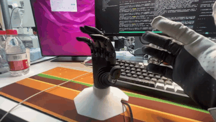

# Revo-Retargeting

BrainCo Revo 灵巧手的手套遥操作与动作重定向工作空间。

`main` 分支只作为项目入口：放项目说明、示例视频和分支导航。真正可编译、可运行的 ROS 2 Humble 工作空间在对应硬件分支里维护。

## 示例视频

| Revo3 retargeting | Revo2 retargeting |
| --- | --- |
|  |  |
| [打开 Revo3 MP4](./videos/revo3_retargeting.mp4) | [打开 Revo2 MP4](./videos/revo2_retargeting.mp4) |

如果当前页面没有直接播放动图，请点击表格下方的 MP4 链接查看。

## 选择分支

| 硬件 | 分支 | 内容 |
| --- | --- | --- |
| Revo2 | `revo2_retargeting` | MANUS / Hex 手套到 Revo2 的遥操作工作空间 |
| Revo3 | `revo3_retargeting` | MANUS 手套到 Revo3 的遥操作工作空间 |

```bash
git clone https://github.com/BrainCoTech/Revo-Retargeting.git
cd Revo-Retargeting

# Revo2
git checkout revo2_retargeting

# Revo3
git checkout revo3_retargeting
git submodule update --init --recursive
```

切到目标分支后，再按照该分支里的 `README.md` 完成依赖安装、SDK 配置、编译、标定和启动。

## Revo2 文档入口

`revo2_retargeting` 分支包含 MANUS 和 Hex 两条 Revo2 遥操作链路：

```text
README.md
README_CN.md
src/brainco_capabilities/manus_revo2_retarget/README.md
src/brainco_capabilities/manus_revo2_retarget/README_HEX.md
src/brainco_drivers/hex_glove_driver/README.md
```

其中 `README_HEX.md` 是 Hex -> Revo2 的完整启动流程，`hex_glove_driver/README.md` 说明 Hex UDP bridge 的底层参数和调试方法。

## Revo3 文档入口

`revo3_retargeting` 分支包含 MANUS -> Revo3 的完整遥操作工作空间，包括 MANUS SDK 配置、ROS 2 包编译、Revo3 driver 对接和 retargeting launch pipeline。

```bash
git checkout revo3_retargeting
git submodule update --init --recursive
```

然后继续阅读该分支的 `README.md`。
