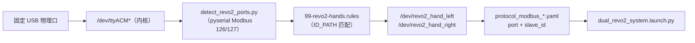

# Revo2 双手 Modbus 串口配置说明

> 变更记录见 dex-grasp 仓库：`doc/5.21/Revo2二代手Modbus串口配置.md`、`doc/5.21/变更记录.md`

本包 **默认仅使用 Modbus 串口**。日常遥操可忽略 `protocol_canfd_*.yaml` 与 launch 的 `canfd` 选项。

- 协议与驱动配置：`config/`
- 串口发现与 udev 绑定：`setup/`

---

## 1. 总览

| 手 | udev 别名 | Modbus `slave_id` | 配置文件 |
|----|-----------|-------------------|----------|
| 左 | `/dev/revo2_hand_left` | **126** | `config/protocol_modbus_left.yaml` |
| 右 | `/dev/revo2_hand_right` | **127** | `config/protocol_modbus_right.yaml` |

原 `/dev/ttyACM*` 设备名**不会被改名**，udev 只是额外创建上述固定别名。

**职责划分：**

| 步骤 | 作用 | 是否启动 ROS |
|------|------|--------------|
| `bootstrap_revo2.sh` | 扫口 + 写 udev 规则 | 否 |
| `check_revo2_setup.sh` | 检查软链接与左右映射 | 否 |
| 编辑 `protocol_modbus_*.yaml` | 指定驱动打开的串口与 `slave_id` | 否 |
| `colcon build --packages-select revo2_driver` | 将 YAML 安装到 `install/` | 否 |
| `dual_revo2_system.launch.py` | 启动左右手 `ros2_control` | 是 |

> **重要：** 双手 launch 时请在两个 YAML 中设置 `auto_detect: false`。若为 `true`，左右两个节点会同时扫描全部串口，容易互相抢端口导致连接失败。

---

## 2. 端口绑定原理

绑定分 **两层**：**udev（系统层）** 把物理 USB 口映射为稳定设备名；**YAML（驱动层）** 把设备名映射为 Modbus 参数。



### 2.1 发现阶段（哪个 tty 是左/右手？）

`bash bootstrap_revo2.sh` 默认 **auto** 模式：

1. 调用 `setup/detect_revo2_ports.py`（SDK-free，pyserial 直发 Modbus 探测；依赖 `python3-serial`）。
2. 扫描串口，按 **slave_id** 识别：
   - **126** → 左手
   - **127** → 右手
3. 输出 `REVO2_LEFT_PORT` / `REVO2_RIGHT_PORT`（例如 `/dev/ttyACM6`、`/dev/ttyACM1`）。

手动指定端口：

```bash
./discover_revo2_serial.sh   # 先列出 tty 与 USB 拓扑
bash bootstrap_revo2.sh /dev/ttyACM6 l /dev/ttyACM1 r
```

### 2.2 udev 绑定（重启后名称不变）

`setup_revo2_udev_rules.sh`（bootstrap 内以 `sudo` 调用）写入：

**规则文件：** `/etc/udev/rules.d/99-revo2-hands.rules`

对当前 tty 读取 udev 属性：

| 属性 | 含义 |
|------|------|
| `ID_VENDOR_ID` | USB 厂商 ID（必须匹配） |
| `ID_MODEL_ID` | USB 产品 ID（必须匹配） |
| `ID_PATH` | USB 物理拓扑（插在哪个 hub/哪个口） |

每只手生成一条规则，例如：

```text
# Auto-generated by setup_revo2_udev_rules.sh
SUBSYSTEM=="tty", ENV{ID_VENDOR_ID}=="1a86", ENV{ID_MODEL_ID}=="55d4", ENV{ID_PATH}=="*-usb-*:1.2:1.0", SYMLINK+="revo2_hand_left"
SUBSYSTEM=="tty", ENV{ID_VENDOR_ID}=="1a86", ENV{ID_MODEL_ID}=="55d4", ENV{ID_PATH}=="*-usb-*:1.3:1.0", SYMLINK+="revo2_hand_right"
```

（厂商/型号/`ID_PATH` 因机器和 USB 口而异；可用 `udevadm info -a -n /dev/ttyACM6` 查看。）

然后重载 udev：

```bash
sudo udevadm control --reload-rules
sudo udevadm trigger --subsystem-match=tty
```

验证：

```bash
ls -l /dev/revo2_hand_*
# revo2_hand_left  -> ttyACM6
# revo2_hand_right -> ttyACM1
```

**路径匹配模式**（`setup_revo2_udev_rules.sh`）：

| 模式 | 说明 |
|------|------|
| `hub-relative`（默认） | 缩短 USB 跳数段，同一 hub 上重插仍可能匹配 |
| `exact` | 完整 `ID_PATH`；hub-relative 左右冲突时自动切换 |

若 bootstrap 后两个别名指向**同一** tty，重跑 `bash bootstrap_revo2.sh`，或：

```bash
sudo bash setup_revo2_udev_rules.sh --path-mode exact /dev/ttyACM6 l /dev/ttyACM1 r
sudo udevadm control --reload-rules && sudo udevadm trigger --subsystem-match=tty
```

**更换 USB 物理口**后，需重新执行 `bash bootstrap_revo2.sh`。

### 2.3 驱动绑定（launch 时 YAML → 硬件）

`dual_revo2_system.launch.py` 启动两个 `revo2_system.launch.py`（左 + 右）：

- 左手：`config/protocol_modbus_left.yaml` → 打开 `/dev/revo2_hand_left`，slave **126**
- 右手：`config/protocol_modbus_right.yaml` → 打开 `/dev/revo2_hand_right`，slave **127**

串口路径、`baudrate`、`slave_id`、`auto_detect` **只在 YAML 中配置**，不在 dual launch 参数里传递。

成功日志示例：

```text
Modbus connection established: port=/dev/revo2_hand_left ... slave_id=126
Modbus connection established: port=/dev/revo2_hand_right ... slave_id=127
Hardware activated successfully
```

---

## 3. 配置文件（完整内容）

路径均相对于 `revo2_driver/` 包根目录。

### 3.1 `config/protocol_modbus_left.yaml`

```yaml
hardware:
  protocol: modbus
  # slave_id: 当 auto_detect 为 true 时，此值作为提示，实际会使用检测到的设备的 slave_id
  # 如果 auto_detect 为 false，则使用此值作为目标 slave_id
  # 注意：左手通常使用 slave_id 126，右手使用 127
  slave_id: 126
  log_level: info
  ensure_physical_mode: true
  ctrl_param_duration_ms: 10
  position_command_scale: 572.9577951308232
  position_state_scale: 0.0017453292519943296
  velocity_state_scale: 0.0017453292519943296
  position_device_min: 0.0
  position_device_max: 1000.0
  # 速度百分比参数 (0-100%)，用于调整执行速度
  # 例如：50.0 表示以 50% 的速度执行，100.0 表示全速
  velocity_percentage: 100.0
  # 当 auto_detect 为 true 时，port 和 baudrate 会被忽略，使用自动检测到的值
  # 当 auto_detect 为 false 时，使用指定的 port 和 baudrate
  port: /dev/revo2_hand_left
  baudrate: 460800
  # 启用自动检测：自动扫描所有可用串口，找到 Revo2 设备
  auto_detect: false
  # 快速检测模式：true 为快速模式（推荐），false 为完整检测（更慢但更准确）
  auto_detect_quick: true
  # 自动检测端口提示：如果指定，只在此端口范围内检测（例如 "/dev/ttyUSB" 会检测所有 ttyUSB*）
  # 留空则检测所有可用串口
  # 对于双手配置，建议为左手和右手指定不同的端口提示，避免冲突
  auto_detect_port: ""
  # 如果自动检测有问题，可以禁用自动检测并手动指定端口：
  # auto_detect: false
  # port: /dev/ttyUSB0  # 根据实际设备端口修改
```

### 3.2 `config/protocol_modbus_right.yaml`

```yaml
hardware:
  protocol: modbus
  # slave_id: 当 auto_detect 为 true 时，此值作为提示，实际会使用检测到的设备的 slave_id
  # 如果 auto_detect 为 false，则使用此值作为目标 slave_id
  slave_id: 127
  log_level: info
  ensure_physical_mode: true
  ctrl_param_duration_ms: 10
  position_command_scale: 572.9577951308232
  position_state_scale: 0.0017453292519943296
  velocity_state_scale: 0.0017453292519943296
  position_device_min: 0.0
  position_device_max: 1000.0
  # 速度百分比参数 (0-100%)，用于调整执行速度
  velocity_percentage: 100.0
  # 当 auto_detect 为 true 时，port 和 baudrate 会被忽略，使用自动检测到的值
  # 当 auto_detect 为 false 时，使用指定的 port 和 baudrate
  port: /dev/revo2_hand_right
  baudrate: 460800
  auto_detect: false
  auto_detect_quick: true
  auto_detect_port: ""
  # auto_detect: false
  # port: /dev/ttyUSB2
```

### 3.3 `config/revo2_controllers.yaml`

launch 使用（`HAND_PREFIX`、`UPDATE_RATE` 由 launch 按左右手替换）：

```yaml
# Unified controller template for a single revo2 hand.
# Launch code replaces:
#   HAND_PREFIX -> left | right
#   UPDATE_RATE -> controller manager update rate
/**/controller_manager:
  ros__parameters:
    update_rate: UPDATE_RATE  # Hz

    load_on_configure:
      - revo2_joint_state
      - joint_forward_pos_controller
      - joint_forward_vel_controller

    activate_on_configure:
      - revo2_joint_state
      - joint_forward_pos_controller

    revo2_joint_state:
      type: joint_state_broadcaster/JointStateBroadcaster

    joint_forward_pos_controller:
      type: forward_command_controller/ForwardCommandController

    joint_forward_vel_controller:
      type: forward_command_controller/ForwardCommandController

/**/revo2_joint_state:
  ros__parameters:
    use_local_topics: true
    publish_dynamic_joint_states: true

/**/joint_forward_pos_controller:
  ros__parameters:
    joints:
      - HAND_PREFIX_thumb_proximal_joint
      - HAND_PREFIX_thumb_metacarpal_joint
      - HAND_PREFIX_index_proximal_joint
      - HAND_PREFIX_middle_proximal_joint
      - HAND_PREFIX_ring_proximal_joint
      - HAND_PREFIX_pinky_proximal_joint

    interface_name: position

    command_interfaces:
      - position

    state_interfaces:
      - position
      - velocity

    action_monitor_rate: 20.0
    allow_partial_joints_goal: false

/**/joint_forward_vel_controller:
  ros__parameters:
    joints:
      - HAND_PREFIX_thumb_proximal_joint
      - HAND_PREFIX_thumb_metacarpal_joint
      - HAND_PREFIX_index_proximal_joint
      - HAND_PREFIX_middle_proximal_joint
      - HAND_PREFIX_ring_proximal_joint
      - HAND_PREFIX_pinky_proximal_joint

    interface_name: velocity

    command_interfaces:
      - velocity

    state_interfaces:
      - position
      - velocity

    action_monitor_rate: 20.0
    allow_partial_joints_goal: false
```

### 3.4 CAN-FD 配置（默认 Modbus 遥操可忽略）

`config/protocol_canfd_left.yaml` / `protocol_canfd_right.yaml` 仅用于 CAN-FD 硬件（`slave_id` 126 / 127）。除非显式 `left_protocol:=canfd` 启动，否则无需关注。

---

## 4. 首次部署

```bash
cd src/brainco_drivers/revo2_driver/setup
bash bootstrap_revo2.sh            # SDK-free，pyserial 探测（依赖 python3-serial）
bash check_revo2_setup.sh

# 驱动本身仍需 Stark SDK：
cd <Revoarm_ws>/src/brainco_drivers/revo2_driver
bash scripts/download_sdk.sh
cd <Revoarm_ws>
colcon build --packages-select revo2_driver
source install/setup.bash
```

确认软链接：

```bash
ls -l /dev/revo2_hand_*
# 期望 left 与 right 指向不同的 ttyACM*
```

---

## 5. 启动双手

```bash
cd <Revoarm_ws>
source install/setup.bash
ros2 launch revo2_driver dual_revo2_system.launch.py
```

| launch 参数 | 默认值 | 说明 |
|-------------|--------|------|
| `left_protocol` / `right_protocol` | `modbus` | 串口遥操用 `modbus` |
| `left_protocol_config_file` / `right_protocol_config_file` | 空 | 覆盖 YAML 路径 |
| `if_sim` | `false` | 模拟硬件 |
| `use_namespace` | `true` | 命名空间 `/revo2_left`、`/revo2_right` |

---

## 6. setup 脚本

| 脚本 | 作用 |
|------|------|
| `discover_revo2_serial.sh` | 列出 tty 与 USB 拓扑 |
| `detect_revo2_ports_auto.sh` | 调 Python 探测器扫 126/127 |
| `detect_revo2_ports.py` | SDK-free 探测器（pyserial Modbus；依赖 `python3-serial`） |
| `setup_revo2_udev_rules.sh` | 写 udev 规则（需 sudo） |
| `bootstrap_revo2.sh` | 一键：发现 + udev + 检查 |
| `check_revo2_setup.sh` | 验证规则与软链接 |

---

## 7. 核对清单

- [ ] 两只手 USB 已连接
- [ ] 左手 `slave_id` = **126**，右手 = **127**
- [ ] `bash bootstrap_revo2.sh` 成功
- [ ] `ls -l /dev/revo2_hand_*`：两个别名指向**不同** tty
- [ ] YAML 中 `port` 为别名路径，`auto_detect: false`
- [ ] 改 YAML 后已 `colcon build --packages-select revo2_driver` 并 `source install/setup.bash`

---

## 8. 常见问题

| 现象 | 原因 | 处理 |
|------|------|------|
| `pyserial not installed` / 探测器报错 | 缺 `python3-serial` | `sudo apt install -y python3-serial` |
| 两个别名指向同一 tty | udev `hub-relative` 冲突 | 重跑 `bootstrap_revo2.sh` 或 `--path-mode exact` |
| launch 扫很多口后失败 | YAML 中 `auto_detect: true` | 改为 `false`，使用 `/dev/revo2_hand_*` |
| bootstrap 成功但 launch 失败 | YAML 未更新或未重新 install | 改 YAML → colcon build → source |
| 扫口时出现 `Invalid function code: 0xFF` | 对非 Revo2 串口试 Modbus | 可忽略，只要最终识别到 126/127 |

---

## 9. 与手臂 CAN 的区别

| 项目 | 手臂 CAN | Revo2 手 Modbus |
|------|----------|-----------------|
| 配置目录 | `Revoarm_can/setup/` | `revo2_driver/setup/` |
| 稳定名 | `left_can` / `right_can` | `revo2_hand_left` / `revo2_hand_right` |
| 启动 | `revoarm.bimanual.system.launch.py` | `dual_revo2_system.launch.py` |

两者互不影响。

---

## 10. 回退 udev 绑定

```bash
sudo rm -f /etc/udev/rules.d/99-revo2-hands.rules
sudo udevadm control --reload-rules
sudo udevadm trigger --subsystem-match=tty
```

回退后需在 YAML 中改回实际 `/dev/ttyACM*`；若临时依赖自动扫口，可设 `auto_detect: true`（**仅建议单手调试，双手不推荐**）。
